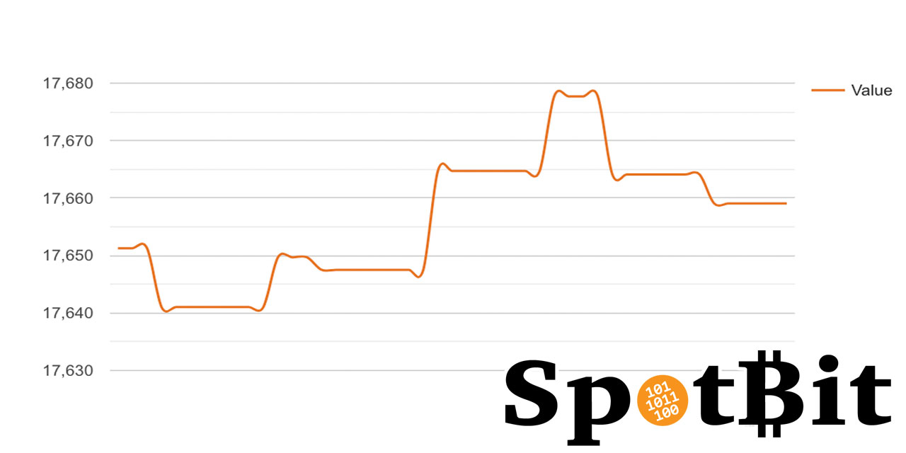

# Torgap made easy
This page is an attempt to explain the benefits and urgency of `bc-torgap` in plain people's language with lots of analogies and further reading.  
If you get lost, try the [definitions](#Definitions) below.

### What’s the problem bc-torgap is going to solve? 

It is a `DID`, a Decentralized Identifier. With an identifier you can, through a `hidden service`, say ‘make verifiable statements about things’, in particular other hidden services, for example: “Hidden service X delivered quality services”

### Wait a minute, ‘hidden service?’, what is that? 

A `Tor hidden service` needs some [explanation](https://blog.torproject.org/nine-questions-about-hidden-services) but briefly defined : 

A "hidden service" is a site you visit, or a service you use, that uses Tor technology to stay secure and, if the owner wishes, anonymous. 

Tor is well known for its browser described with an analogy this way:  
"It’s like the Ray-Ban Wayfarer of browsers. These are sun glasses through no one can see what you’re watching. And it makes you look cool and mysterious." [Source](https://sidewaysdictionary.com/#/term/tor)  
But Tor is so [much more](https://www.torproject.org). You have to look into that seperately one day.

 As an example, you could call the hidden service Blockchain Commons [Spotbit]( https://github.com/BlockchainCommons/spotbit), that anonymously answers the question _what's the current bitcoin price?_. And the service responds (not surprisingly) “the current bitcoin price is Y.”

### So what’s the whole point if it does expected things?! 

Sorry, it’s complicated, please hold on. What just happened is *a marvelous mix of technologies* we’ve had for some years already. We just needed time to put them together the right way. The building blocks just need to be assembled in an unprecedented way.  
Features:  
1.	Privacy.  the only way to anoymize is via a Tor connection.
2.	Speed.  Provide information more quickly and at a higher rate due to the use of a local database.
3.	Reliability. Aggregrate information, making your data more trustworthy.
4.	Self-sovereignty. The hidden service runs from your server (or that of your choice), saves to your database, and allows you to choose the details of the  services relevant to your business or private life.
5.	Verifiable statements. You can offer statements that are shareable, and someone can confirm the statement without revealing what statement they are confirming. It's a kind of `zero knowledge proof`.

### "Wow, impressive list, but that last feature description ruined it!" 
#### This is total gibberish “confirm statement without revealing what statement; someone, they”, etc. *What have you been smoking?!* 
Sorry again, no soft drugs involved. Let me try to give you a real life example:

##### Right now if I sign a letter on paper with my signature and give it to you, and you give it to John, John doesn’t know you just didn’t create a signature of your own. He needs to independently verify it. Now suppose we just solved that ages old problem: John doesn’t need to verify anymore, as long as he trusts the chain of digital signatures that is inherently associated with bc-torgap.

And it’s getting even better! You could say to anyone _"These are some other keys you can use to communicate with me”_ This is an important use. Or you could write _“You can leave messages addressed to anonymous user Z here”_. That's another feature.

### "Man, you nerds are scary folks. Can't you explain it to me , using an every day's tool, like a box of matches." 

Alright, a box of matches. Let me see....

##### Suppose every person colors the matches uniquely for him/herself. Think of your own matches as magic sticks that are able to encrypt messages to you from someone else. Everybody in this fairy-tale world has sticks of people they trust. 
 
##### Now you give the matches to people, who want to send secret messages to you. Scrambled encrypted notes, unreadible for others. The sender is able to send these secrets by magically touching letters by one of your personal magic sticks. These are the matches you gave to them earlier on). The letter miraculously scrambles into unreadible goo. 
##### Lastly, suppose that you alone could decrypt and read the message after it has been magically touched by one of your personal matches. This is accomplished by another pieces of magic: when the issued stick, that comes back combined with the scrambled letter goes back into the matchbox where it came from. 
##### People in a network could make a chain of secret letters this way. Senders can burn  matches. A match becomes useless after being lit: the magic disappears. As soon as a recipient burns a matchbox, all the matches are rendered useless, the chain is broken. The letters encrypted with these matches in the past, will be are forever unreadable.

The analogy with real world encryption: The matchbox is a secret master key, that has public keys (matches). Senders and receivers use digital messages through peer to peer networks.

### "OK, so your new _identity thing_ is known by the government and the banks and the police?" 

Bc-torgap wants to avoid `subject=person` statements for now. That means, we do not facilitate what so many other solutions instead will do: reveal counterparties in a group of people that interact with eachother. *We don't reveal people's identities to others.*

### Why is that a problem? I am not interested in anonymity, I’ve got nothing to hide! 

This is a well-know misconception. A few analogies of anonymity:
`Anonymization` is like pixelating someone’s face in a video. You can still hear what they say, but you don’t know who they are. It’s like footprints in the sand. After a period of time (that depends on the policy of your search engine), a wave comes in and wipes out each visitor’s footprints. [Source](https://sidewaysdictionary.com/#/term/anonymization)

For those who have the opinion that they don't care about anonymity, we have a closely related counter-question: 

If you don't care about anonymity, would you then care for your `privacy`? If so, then you care about anonymity too, because `privacy` is built on a foundation of anonymity)?
What you’ve got to hide, are the wrong conclusions drawn from the sensitive data that describe you.

This is the whole point of sovereignty. `Self-sovereignty` means that you are for an important part in charge of your own data; like you are in charge of your own body and mind.

### We're getting lost; where comes 'bc-torgap' into play? 

After you get used to secret keys to protect yourself, to enable yourself in the digital world and to control digital data and transactions with these keys. 

“These are some other keys you can use to communicate with me” is an important use.

### Keys, keys, keys, I get sick of keys and passwords and such! 
Now it’s our turn to ask _‘what have you been smoking?’_. Or for those who have lived under a rock, a short introduction to our 21th century world:

1. [The social dilemma](https://www.thesocialdilemma.com); documentary film: The technology that connects us, also controls us.
2. [Borderless world](https://www.citizen.org/article/privacy-needs-protection-in-a-borderless-world/)

If you still hang on, or caught up with me, these insights lead to the *new digital world’s* version of the example already laid out above:

##### “Right now, if I sign something and give it to you, and you give it to John, John doesn’t know you just didn’t create a secret KEY of your own. He needs to independently verify it.

### Phew, why not call a server that neatly verifies for you, all your bc-torgapping? 

If we'd use an `API` we would have to trust the service party. Before you get started about APIs, here some analogies what an API does: 
**It’s like the connectors on the back of your TV**. They let you plug in a device from another manufacturer (DVD player, games console, set-top box) and both the TV and the device know what to do next. The connectors are the interface that lets one machine talk to another.    
**It's like a waiter at a restaurant**. The waiter takes a guests' food order, then delivers to the food order to the kitchen staff. The kitchen staff then makes the food, hands the food to the waiter, and then the waiter delivers the correct food order back to the guest.  [Source](https://sidewaysdictionary.com/#/term/API)

So for our purpose API and external service just won't do. Because we have to trust third parties and our identity could be revealed in the process to others.

### Okay, got it: it's great, it's new, it's relevant, but can I eat, can I wear it, can I ride it? 

I agree we need to explain some better use cases.

`Spotbit` is one of the first. “This price data was collected and verified by this price service on this date”

But later we can do other kinds of service: 
**Store of digital value** : “I will store 10k encrypted object you give me for 1000 satoshi an hour” along with verifiable credential statements from others “I used this service successfully for x days” and one of those ids you trust. 
**Programcode and software distribution signing** is another possible area of application. The problem we could solve is that digital signatures tend to expire, long before the proof of the signature is needed.

In fact through **bc-torgap** flow anonymous `virtual credentials`, a kind of digital certificates; issued 'now' by unknown - but trusted parties. Go the [definition section](#VC---Virtual-Credentials) for what Virtual Credentials are. **What is certificate?** Two analogies:  
**It’s like a passport** – issued by a central authority (the passport office / certificate authority), who independently establishes your identity and gives you a passport to prove it to others. Like a passport, a certificate will have in-built security and anti-fraud features. 
**It’s like a license plate.** A central authority issues the numbers and ensures each license plate number is matched to the right vehicle. Both drivers and police trust this third party to keep the right details on file. [Source](https://sidewaysdictionary.com/#/term/certificate)

It’s a hard problem too, as there are some substantial arguments about how to do this safely by the `LESS` identity community. 

### More or less, less is more?! 

"Yeah but, no but...." not this way. 

LESS is an abbreviation of Legally Enabled Self-Sovereign Identity. It is a group of experts, organisations and users that believe in verifiable credentials issued by legal bodies as a way to overcome lots of practical problems that arise while assembling self-sovereignty.

In case of LESS it starts with control of your keys. A government can revoke your `VC` authorization to drive, but not your other VCs to receive medical care or do business. Better than the current. Keep a separation of interests.

However in our vision, it has to be more of **MORE: "My Own Reputation Emerges"** from the web, securely, privately, sovereignly, and self-imposed.

LESS is the easier way to go, but you sell your a bit of your pure self-sovereign soul on the way. MORE is harder, stricter, more free and more authentic.

### Touching, but time's running out, can I earn money with bc-torgap? 

It integrates well with the Lightning Network. Especially because we're able to simultaneously let money (satoshis) flow alongside, for services and their VCs (e.g. "quality is good").

## Definitions
In Alphabetic order

#### Anonymity
Anonymity describes situations where the acting person's identity is unknown. Some writers have argued that namelessness, though technically correct, does not capture what is more centrally at stake in contexts of anonymity. The important idea here is that a person be non-identifiable, unreachable, or untrackable. Anonymity is seen as a technique, or a way of realizing, a certain other values, such as privacy, or liberty. Over the past few years, anonymity tools used on the dark web by criminals and malicious users have drastically altered the ability of law enforcement to use conventional surveillance techniques. [Know more](https://en.wikipedia.org/wiki/Anonymity#Pseudonymity)

#### DID - Decentralized Identifier
A new type of globally unique identifier (URI) that does not require a centralized registration authority because control of the identifier can be proved using cryptography. 

#### LESS identity - Legally Enable Self-sovereign identity
{TBW}

#### Privacy
Privacy is a fundamental right, essential to autonomy and the protection of human dignity, serving as the foundation upon which many other human rights are built.
Privacy enables us to create barriers and manage boundaries to protect ourselves from unwarranted interference in our lives, which allows us to negotiate who we are and how we want to interact with the world around us. Privacy helps us establish boundaries to limit who has access to our bodies, places and things, as well as our communications and our information. [Source](https://www.privacyinternational.org/explainer/56/what-privacy) [Know more](https://medium.com/fortknoxster/what-is-privacy-and-why-does-it-matter-8648b2b8a297)

#### Pseudonymity
Pseudonymity is the state of being identified by a pseudonym, that is by a name, which is not somebody’s real, correct name. Furthermore, being pseudonymous in virtual communities means bearing a set of false distinctive characteristics, such as name and title that are used for identification and to some degree for interaction of the person concerned. The property that a user cannot be identified within the total user population, but her interactions nevertheless be tracked. [Source](https://www.igi-global.com/dictionary/privacy-digital-world/23971)

#### SSI - Self-Sovereign Identity
Is the concept that people and businesses can store their own identity data on their own devices, and provide it efficiently to those who need to validate it, without relying on a central repository of identity data.
[Know more](https://bitsonblocks.net/2017/05/17/gentle-introduction-self-sovereign-identity/): A gentle introduction to self-sovereign identity

#### URI - Uniform Resource Identifier (URI)
 A string of characters that unambiguously identifies a particular resource. To guarantee uniformity, all URIs follow a predefined set of syntax rules, but also maintain extensibility through a separately defined hierarchical naming scheme (e.g. http://). -> [Know more](https://en.wikipedia.org/wiki/Uniform_Resource_Identifier)

#### Tor hidden service
A hidden service is a site you visit or a service you use that uses Tor technology to stay secure and, if the owner wishes, anonymous. 

#### VC - Virtual credentials
Credentials are a part of our daily lives; driver's licenses are used to assert that we are capable of operating a motor vehicle, university degrees can be used to assert our level of education, and government-issued passports enable us to travel between countries. This specification provides a mechanism to express these sorts of credentials on the Web in a way that is cryptographically secure, privacy respecting, and machine-verifiable. [Know more](https://www.w3.org/TR/vc-data-model/)
 
 #### ZKP - Zero Knowledge Proof
Is a method to prove the data without actually revealing the data. The person you’re proving to, doesn’t learn anything more than the bare fact that you’re proving. [Know more](https://medium.com/@pranshurastogi/zero-knowledge-proofs-a-method-to-conserve-privacy-1b072222ac1a) and analogies.